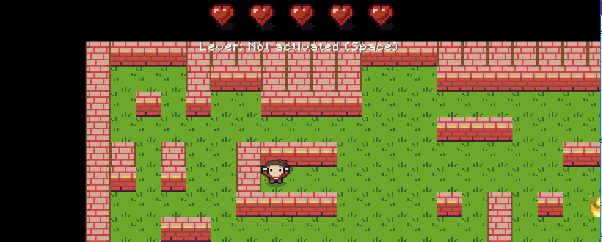

# Maze Runner Game

The Maze Runner Game is a Java-based game developed using LibGDX. Your goal is to reach the lever and open it.
Reach the exit door before you run out of lives. You will lose a life when you touch one of the traps. Good luck! 

## Game Overview

The game consists of various classes and screens, each serving a specific purpose. Here's an overview of the main components:

### Key Features

The `MazeRunnerGame` class represents the core of the Maze Runner game. It manages screens, global resources like `SpriteBatch` and `Skin`, and handles the game's initialization.

- The game is able to read any maze from a properties file.
- Handles player movement and interactions.
- Handles different collisions.
- Player loses a life when in contact with any of the traps.
- Camera movement mechanism where the player is at the center of the screen.
- Manages game sounds and animations.
- Manages different game screens (Menu, Game, Pause, Win, Game Over).
- Uses object-oriented programming
- Goal: Victory or Game Over 

### Classes

## Objects

### GameObject
The `GameObject` class is a superclass for various game objects. It includes attributes such as position, size, and collision checks.

### Ghost
The `Ghost` class represents an enemy character in the game. It includes methods for rendering and updating the ghost's position.

### Wall

### Door
Every level of the maze has only one entry point, represented in the `Door` class. It contains a texture region and coordinates for rendering.

### Exit 
Every level can have 1 or more exits, represented in the `Exit` class. It uses separate texture regions for open and closed states for rendering.

### Key 
Every level has a final level which one needs to turn in order to open the exit doors. The `Key` class includes logic to render the key based on whether it is collected.

## Game Logic

### Player Movement
The player can move in four directions (up, down, left, right) based on keyboard input. 

### Ghost Behavior
The `Ghost` class includes logic for random movement. The ghost changes direction at regular intervals and moves within the boundaries of the game.

### Obstacle Interaction
The `Obstacle` class includes logic for rendering obstacles (fire) and checking collisions with the player. Colliding with an obstacle decreases the player's lives.

## Screens

### MenuScreen

The `MenuScreen` class displays the main menu of the game. It allows players to load maps, start the game, or exit.

Key Features:
- Displays the game title and options to load maps or exit.
- Utilizes a file chooser for selecting game maps.

### GameScreen

The `GameScreen` class represents the actual gameplay. It includes the maze, player, obstacles, and handles player input and collisions.

Key Features:
- Renders the maze and player on the screen.
- Handles player input for movement and interactions.
- Manages game logic such as collisions and level progression.

### PauseScreen

The `PauseScreen` class provides a pause menu during gameplay. It allows players to continue, load maps, or exit the game.

Key Features:
- Displays a pause message and options to resume, load maps, or exit.

### WinScreen and GameOverScreen

These screens display messages when the player wins or loses the game.

Key Features:
- Shows a victory message in the `WinScreen`.
- Displays a game over message in the `GameOverScreen`.

### HUDScreen

The `HUDScreen` class represents the Heads-Up Display during gameplay. It displays the player's remaining lives.

Key Features:
- Displays heart icons representing the player's remaining lives.
- Displays whether the lever has been opened or not

## How to Play

1. **Main Menu:**
    - Load Map: Select a map to play.
    - Exit: Quit the game.

2. **Gameplay:**
    - Use arrow keys for movement.
    - Avoid obstacles such as fire and enemy such as ghosts.
    - Reach the lever and press "Space" to open it.

3. **Pause Menu:**
    - Press ESC to pause the game.
    - Continue: Resume the game.
    - Load Map: Select a different map.
    - Exit: Quit the game.

4. **Win or Game Over:**
    - Press 'Enter' to return to the main menu.

## How to Run

### Prerequisites
- Java installed on your system.
- LibGDX framework.

### Running the Game

1. Clone the repository.
2. Open the project in your preferred IDE.
3. Run the `MazeRunnerGame` class to start the game.

## Dependencies

- LibGDX: The game development framework used for graphics and input handling.

## Contributing

If you'd like to contribute to the project, please follow these steps:

1. Fork the repository.
2. Create a new branch for your feature or bug fix.
3. Make your changes and submit a pull request.

Feel free to contribute or report issues!
